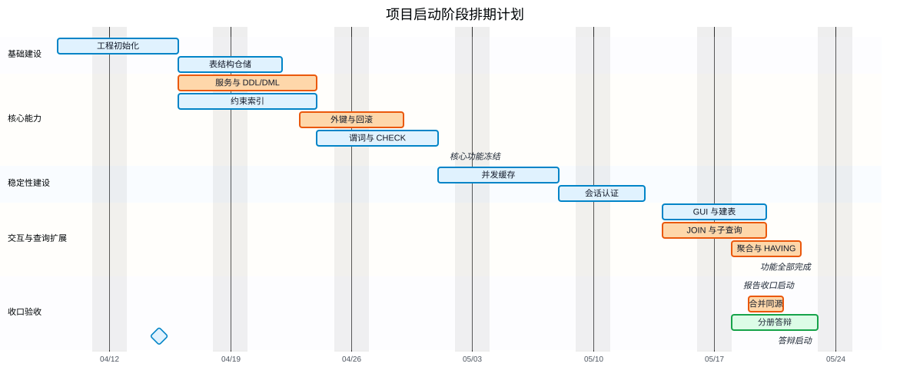
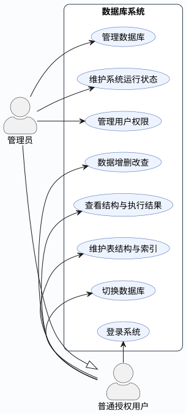
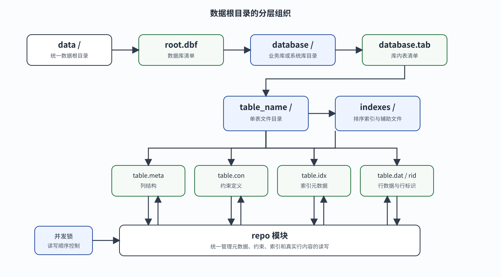
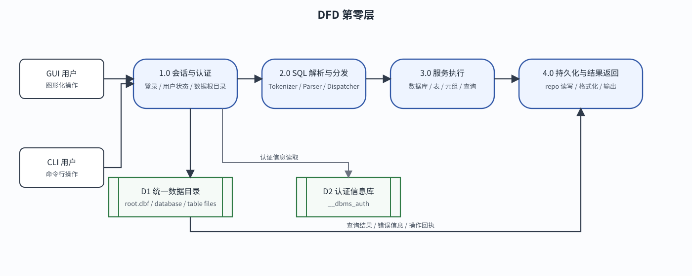
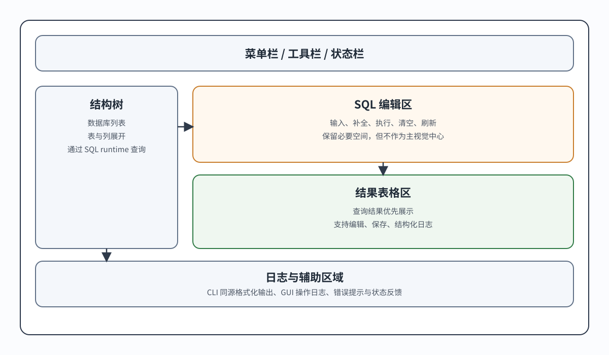
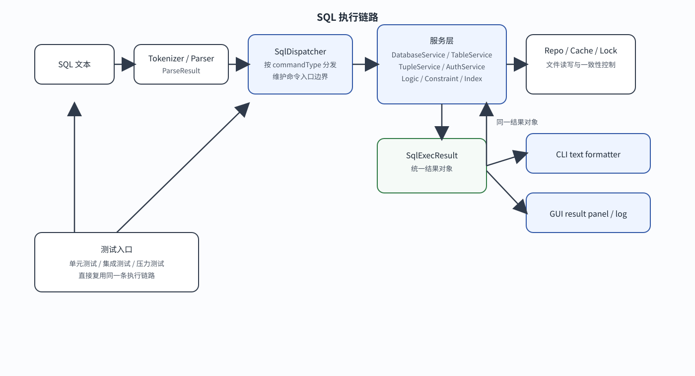
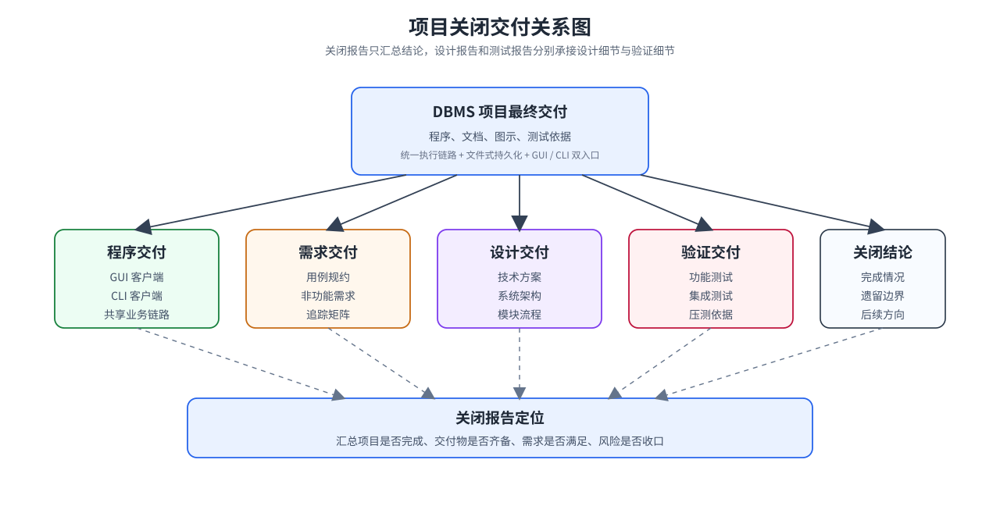
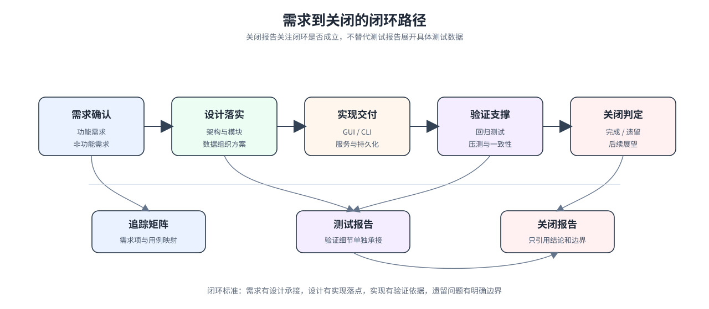

# DBMS 项目文档

Version: 1.0

本文档依据项目材料和提交历史编写，整体拆分为启动报告、需求分析报告、设计报告和关闭报告几个部分。第一章作为启动报告，说明项目背景、项目挑战、建设内容和排期计划；第二章作为需求分析报告，说明模块划分和用例建模；第三章和第四章作为设计报告，说明技术方案、系统逻辑和模块协作；第五章作为关闭报告，说明项目完成情况、交付成果、需求满足情况、主要问题处理和后续展望。本项目是一个基于 C++17 与 Qt 6 的文件式数据库管理系统，提供图形化客户端和命令行客户端两种入口，并通过统一的客户端会话、SQL 解析、语句分发、服务执行和文件持久化链路完成数据库操作。

文档修订历史如下。本版本为分册整理版，修订原因是将原有项目书按照启动、需求分析和关闭三个报告口径重新组织，并补充与提交历史对应的阶段排期。修订日期为 2026 年 5 月，修订范围覆盖项目概述、需求分析、技术方案、系统逻辑与总结展望。

## 1 项目概述

### 1.1 项目背景

本项目面向数据库原理课程设计与本地数据库管理系统实验场景，目标是在不依赖外部数据库引擎的前提下，完整实现从 SQL 文本输入到数据文件落盘的核心链路。系统采用 C++17 和 Qt 6 开发，既包含桌面图形界面，也包含独立命令行入口。图形界面负责面向用户的结构树、SQL 编辑区、结果表格和操作日志，命令行入口负责脚本执行、交互式输入和自动化测试，两者并不是两套数据库实现，而是共用同一套解析、分发、服务和持久化代码。

从已有数据库产品看，成熟关系型数据库大致可以分为服务端数据库、嵌入式数据库和数据库管理工具三类。MySQL、PostgreSQL、SQL Server 等服务端数据库拥有完整的 SQL 执行器、事务系统、权限体系、优化器和网络访问能力，适合生产环境中的多用户并发访问，但它们的内部实现复杂，课程设计很难在有限周期内完整复现。SQLite 代表了嵌入式文件数据库的典型方向，它不依赖独立数据库服务器，能够把数据组织在本地文件中，适合单机应用和轻量级存储，但其成熟实现已经封装了页式存储、事务日志、查询计划等大量底层细节，直接使用 SQLite 并不能体现学生对数据库执行链路的实现过程。Navicat、DataGrip、DBeaver 等工具则主要面向数据库连接、结构浏览、SQL 编辑和结果展示，本身通常不负责实现数据库内核。

本项目的定位介于嵌入式文件数据库和数据库管理工具之间。它不追求替代 MySQL、PostgreSQL 这类完整服务端数据库，也不只是制作一个连接外部数据库的图形界面，而是在本地文件系统之上自行实现数据库目录、表结构、约束、索引、数据行、SQL 解析、查询执行、认证授权和结果展示。这样的定位能够保留文件式数据库易观察、易调试、易测试的特点，也能让 GUI 和 CLI 体现数据库管理工具的使用方式。与直接调用成熟数据库产品相比，本项目更强调教学场景中的“可解释实现”，即用户输入一条 SQL 后，系统内部如何完成解析、分发、校验、读写和展示都能够在代码和测试中找到对应位置。

从项目规划看，系统需要从单一窗口数据管理程序扩展为分层明确的文件式 DBMS 原型。界面层负责交互和展示，客户端层负责会话和认证上下文，控制层负责把解析结果映射到服务入口，服务层负责数据库语义、约束校验和权限判断，仓储层负责文件读写，工具层则承担 SQL 解析、逻辑表达式求值、缓存和运行时锁管理。这样的结构能够在教学规模内呈现数据库系统的关键组成部分，同时保留继续扩展的工程基础。

本项目的定位不是商业数据库服务器，也不是网络型数据库服务端，而是本地嵌入式文件型 DBMS。GUI 进程和 CLI 进程都应内嵌同一套服务端逻辑，最终访问统一的数据目录。为了避免 GUI 与 CLI 因启动目录不同而读取不同数据，系统需要把默认数据根目录收口到仓库外部统一的 `data` 目录，并保留 `--data-root`、`DBMS_GUI_DATA_ROOT` 和 `DBMS_DATA_ROOT` 等显式覆盖方式，用于测试和多环境运行。

### 1.2 项目挑战

本项目的主要挑战来自“自行实现数据库执行链路”这一目标本身。系统不能把 SQL 直接转交给成熟数据库引擎，而必须自己完成词法分析、语法解析、命令分发、约束检查、文件读写、结构维护、结果展示和错误返回。每个环节如果没有清晰边界，就容易出现界面层直接访问文件、解析层夹杂业务逻辑、服务层依赖窗口状态、CLI 与 GUI 行为分叉等问题。因此，项目需要从启动阶段就强调分层收口，使 SQL 进入系统后始终沿着同一条执行管线向下传递。

另一个重要挑战是文件式持久化带来的结构一致性问题。数据库、表、列、约束、索引、行数据和行标识都需要由本项目自行组织到文件系统中，结构变化时不仅要修改数据文件，还要同步更新元数据、约束文件、索引文件和缓存状态。与使用成熟数据库不同，项目需要自己处理创建失败后的清理、删除表时的关联文件处理、修改列后的数据迁移、外键动作对多表数据的影响，以及索引缺失或损坏时的运行时修复。

并发和多客户端一致性也是项目需要面对的问题。GUI 和 CLI 可以作为不同进程访问同一数据目录，进程内部也存在多客户端会话和多线程测试场景。系统需要通过运行时锁、目录缓存失效、表级读写锁和服务层顺序控制来维持基本一致性。由于项目定位为本地文件式 DBMS，事务与并发能力需要在课程设计范围内划定清晰边界：系统应重点保证单次 DDL、DML、索引维护和外键级联操作具备可检测、可清理、可测试的执行过程，同时把更完整的事务隔离、日志恢复和崩溃恢复机制保留为后续扩展方向，避免在启动阶段承诺超出项目规模的商用数据库能力。

前端交互一致性同样是一个挑战。项目存在 GUI 和 CLI 两种入口，用户希望同一条 SQL 在两个入口中看到一致的结果。系统需要把 SQL 执行结果的文本格式化逻辑收口到客户端公共能力中，使 CLI 输出和 GUI 日志共享同一套格式化规则。与此同时，GUI 仍然需要保留表格控件展示和操作日志，因为图形界面承担结构树、表格编辑、可视化建表和保存操作等职责，这些内容不能简单退化为终端文本。

### 1.3 项目内容

本项目拟建设一个覆盖数据库管理、表结构管理、数据操作、查询执行、权限认证、图形界面和命令行交互的本地 DBMS 原型。项目建设内容以“可运行、可测试、可展示、可维护”为基本目标，要求系统既能够支撑课程设计中的数据库功能演示，也能够通过自动化测试证明核心链路的稳定性。数据库管理部分计划支持创建、删除、切换和展示数据库，并通过统一数据根目录维护数据库清单。表结构管理部分计划支持建表、删表、查看表结构、展示建表语句、增加列、删除列、修改列、增加约束、修改约束、删除约束、创建索引和删除索引。数据操作部分计划支持插入、查询、更新和删除，并在服务层执行非空、唯一、主键、外键、检查约束和默认值相关规则。

查询能力是项目建设的重要组成部分。普通查询需要支持投影、别名、条件过滤、排序和限制行数；多表查询需要支持逗号连接和显式 JOIN，并在解析和执行阶段处理表名、别名、列名解析和 JOIN ON 条件；复杂谓词需要覆盖 AND、OR、NOT、比较、LIKE、IS NULL、IN、NOT IN、BETWEEN、NOT BETWEEN、EXISTS、IN 子查询以及 ANY、ALL 量化子查询；聚合查询需要支持 GROUP BY、HAVING 和基础聚组函数，包括 COUNT、SUM、AVG、MIN 和 MAX，并支持聚合结果的别名、排序和限制行数。项目同时需要明确阶段边界，避免把窗口函数、DISTINCT 聚合、复杂算术投影和完整事务恢复等较大功能纳入第一期目标。

权限认证部分计划通过内置认证库维护用户和数据库权限。系统启动时需要能够初始化认证存储，root 用户拥有管理权限，普通用户通过授权访问对应数据库。CLI 需要支持参数登录和交互提示登录，GUI 需要创建专属会话并进入管理视图。客户端会话保存当前用户、当前数据库和数据根目录，执行 SQL 时由客户端执行引擎把会话状态绑定到服务层上下文，从而避免不同客户端之间污染全局状态。

图形界面部分计划包含结构树、SQL 编辑器、结果面板、日志区域、可视化建表和新增列对话框。结构树需要通过 GUI client runtime 查询数据库和表结构，避免直接访问文件；结果区优先展示查询表格，并把 SQL 执行结果以 CLI 同源文本写入日志；SQL 编辑区提供关键字补全和执行入口；可视化建表和表格保存功能通过生成 SQL 或调用统一执行入口完成结构和数据变更。命令行部分提供一次性执行和 REPL 交互，支持 `.help`、`quit`、`exit` 等终端命令，查询与展示类语句以终端表格格式输出。

从启动报告的交付角度看，本项目的成果不只包括可运行程序，还包括可复查的工程材料。程序交付物包括图形化客户端、命令行客户端、共享业务代码、统一数据目录和测试入口；功能交付物包括数据库对象管理、表结构维护、约束索引、复杂查询、认证授权和结果展示；质量交付物包括解析测试、服务测试、客户端测试、GUI runtime 测试、集成测试、压力测试以及与报告配套的架构图、用例图、数据流图、存储组织图和排期图。项目启动阶段需要明确这些交付物的范围，避免后续把展示性界面、后端语义和测试材料割裂开来。

项目验收口径以“同一条 SQL 在同一数据目录上得到一致语义结果”为核心。GUI 和 CLI 可以采用不同交互方式，但不应形成两套业务规则；服务层可以使用文件式存储，但必须保证结构变更、数据写入、索引维护和权限判断具有可测试的错误路径；报告可以拆分为启动、需求分析和关闭三个子报告，但三者应围绕同一项目目标展开，启动报告说明为什么做和如何安排，需求分析报告说明需要做什么，关闭报告说明最终如何实现、如何验证以及后续如何演进。

### 1.4 项目排期计划

项目排期依据整体提交历史进行抽象整理。由于本项目具有明显的增量开发特征，排期不是简单按照模块平均切分，而是按照基础设施、核心服务、查询能力、并发性能、客户端入口、界面完善和最终收口的依赖关系安排。前一阶段主要为后一阶段提供可复用的文件组织、服务边界和测试基础，后一阶段则在前序链路上继续扩展 SQL 语义、用户交互和验收材料。为了让启动报告中的排期更接近计划表达，甘特图没有机械复刻每个提交的自然日期，而是把相邻任务统一到更稳定的阶段窗口，并用依赖关系表达任务先后。

项目第一阶段安排在 2026 年 4 月上旬至 4 月中旬，重点完成工程初始化、文件操作仓储、文件后缀与路径命名收口以及表结构对象化。该阶段的目标不是追求丰富 SQL 能力，而是先确定数据库、表、元数据和文件读写的基本边界，为后续服务层和测试层提供稳定落点。项目第二阶段安排在 4 月中下旬，重点完成数据库服务、表服务、元组服务、DDL、DML、索引、基础约束和外键动作。该阶段形成数据库系统最小可用闭环，使建库、建表、插入、查询、更新、删除、约束校验和索引维护能够通过服务接口被验证。

项目第三阶段安排在 4 月下旬，重点完成前后端初步对齐、复杂谓词逻辑、WHERE 与 CHECK 的连接以及边界测试补充。该阶段的核心目标是让 SQL 条件表达式从简单比较扩展到可维护的 AST 和求值器，并把表达式能力接入真实数据操作。项目第四阶段安排在 5 月上旬，重点完成运行时锁、目录缓存、表级状态检查、线程锁收口、索引读写优化和压力测试。该阶段用于解决文件式 DBMS 在重复读取、并发访问和索引维护上的工程风险。

项目第五阶段安排在 5 月上旬至中旬，重点完成客户端会话运行时、CLI 基础入口、认证授权、GUI 会话接入和系统认证库保护。该阶段把系统从单一内部服务调用扩展到多客户端入口，并明确普通用户、root 用户、当前数据库和数据根目录之间的关系。项目第六阶段安排在 5 月中旬，重点完成可视化建表、表格编辑修复、别名查询、多表 FROM、显式 JOIN、LIKE 谓词和相关子查询收口。该阶段使系统从单表 CRUD 扩展到更接近实际 SQL 使用的查询能力，同时保证 GUI 的操作体验能够覆盖常见管理场景。

项目第七阶段安排在 5 月中下旬，重点完成 GROUP BY、HAVING、聚合函数、合并冲突收口、统一数据目录、GUI 与 CLI 输出同源和结构树展示修复。该阶段的目标是消除多分支开发带来的后端逻辑偏差，使查询能力、客户端入口和主界面成果在同一业务链路下收口。项目最后阶段围绕报告分册、图示绘制、回归测试和答辩准备展开，将启动报告、需求分析报告和关闭报告分别收口，使项目材料能够对应开发过程、需求边界和最终实现。

图1-1 以 Mermaid 甘特图形式展示项目阶段安排。图中的阶段色块表示主要工作窗口，`after` 依赖用于表达任务之间的先后关系，里程碑用于标识核心功能冻结、功能全部完成、报告收口启动和答辩启动等关键节点。为了让图示更适合排期报告，图中把报告收口启动节点提前到功能完成前后的位置，使后续合并收口、图示材料和答辩准备能够被视为并行推进的验收工作。该图不是逐日工时统计，而是用于说明系统从基础存储、核心服务、复杂查询、客户端入口到文档验收的推进逻辑。

从风险控制角度看，排期中最关键的依赖有三类。第一类是文件存储和表结构对象化，它决定后续服务层是否能够稳定落盘；第二类是服务层、约束索引和复杂谓词，它决定系统是否能够支撑真实 SQL 语义；第三类是客户端会话、GUI 与 CLI 同源输出以及统一数据目录，它决定最终展示是否会与后端能力脱节。项目启动时把这些依赖显式写入排期，可以减少后期合并时出现功能分叉和重复实现的风险。

从阶段验收角度看，每一阶段都应形成可检查结果。基础建设阶段以仓储接口和表结构对象为验收重点，核心能力阶段以 DDL、DML、约束、索引和外键测试为验收重点，稳定性建设阶段以锁、缓存和压力测试为验收重点，交互与查询扩展阶段以 GUI 操作链路、多表查询和聚合查询为验收重点，收口验收阶段以合并冲突清理、回归测试、图文材料和分册报告为验收重点。这样安排可以使启动报告中的排期不是形式化日期排列，而是与后续需求分析和关闭报告形成连续关系。

## 2 需求分析

### 2.1 模块划分

系统模块划分应围绕用户希望完成的业务目标展开，而不是围绕代码目录、类名或实现层级展开。本项目的需求可以归纳为用户访问与交互、身份认证与权限控制、数据库对象管理、表结构与索引维护、数据增删改查、关系查询表达、数据持久保存、运行一致性保障和质量验证几个功能域。这些功能域共同构成用户对一个本地 DBMS 原型的完整期待，即用户能够进入系统、获得合适权限、管理数据库和表、操作数据、表达查询、看到稳定结果，并在错误或边界场景下得到明确反馈。

用户访问与交互需求强调系统应提供适合不同使用场景的入口。面向直观操作的用户需要能够通过图形界面浏览数据库结构、输入 SQL、查看表格结果、观察执行日志，并通过可视化方式完成常见结构维护；面向脚本执行和自动化验证的用户需要能够通过命令行完成登录、切换数据库、执行 SQL、查看结果和处理错误。两类入口的交互方式可以不同，但用户对数据库语义的预期应当一致，同一条 SQL 在相同权限和相同数据目录下不应因为入口不同而产生不同业务结果。

身份认证与权限控制需求强调系统必须区分管理员和普通授权用户。管理员需要拥有用户管理、权限授予、权限回收和系统状态维护能力；普通授权用户需要在登录后访问被授权的数据库，并被禁止访问未授权数据库和系统内部认证数据。该功能域的重点不是如何保存密码或如何实现认证表，而是保证用户身份、数据库访问范围和管理权限之间存在清晰边界，使系统具备基本的多用户管理能力。

数据库对象管理需求关注数据库本身的生命周期。用户需要能够创建数据库、删除数据库、查看数据库列表、选择当前数据库，并在不同数据库之间切换工作上下文。该功能域要求系统始终能够明确当前操作作用于哪个数据库，并在数据库不存在、权限不足、数据库被删除或当前库未选择等情况下给出可理解的错误反馈。表结构与索引维护需求进一步关注库内对象的生命周期，用户需要能够创建表、删除表、查看表结构、调整列定义、维护约束、创建索引和删除索引，并希望系统在结构变化时保持已有数据、约束关系和索引状态的一致。

数据增删改查需求是系统最核心的业务需求。用户需要能够向表中插入记录，按照条件查询记录，修改符合条件的数据，并删除不再需要的数据。数据操作过程中，系统需要遵守列类型、默认值、非空、唯一、主键、外键和检查条件等规则，并在违反规则时拒绝操作。对于外键关联数据，用户期望系统能够根据约束定义执行限制、级联、置空或默认值处理，避免出现父子表关系被破坏的情况。

关系查询表达需求关注用户能否用 SQL 描述更复杂的数据检索意图。系统需要支持字段投影、别名、条件过滤、排序、限制行数、多表连接、子查询、LIKE、BETWEEN、分组、HAVING 和聚合函数等常见查询能力。该功能域的需求边界是满足课程设计和本地数据库管理中的常见关系查询，而不是完整覆盖商业数据库的所有 SQL 标准特性。窗口函数、复杂表达式投影、成本优化器和完整事务语言可以作为后续扩展方向，而不应混入第一阶段需求。

数据持久保存与运行一致性保障需求关注系统在本地文件环境下能否稳定保存和恢复数据。用户期望数据库、表、结构、约束、索引和真实记录在程序关闭后仍然存在，并且再次启动后能够继续被访问。系统还需要在创建失败、结构变更失败、约束冲突、索引异常、并发访问和多客户端访问时保持可控状态，避免留下明显的半成品数据或相互矛盾的结构信息。质量验证需求则要求上述功能能够被重复检查，既要覆盖正常业务路径，也要覆盖权限失败、语法错误、约束冲突、级联边界、索引生命周期、界面入口和命令行入口等场景，从而证明需求不是停留在描述层面，而是能够形成可验收的项目结果。

### 2.2 用例建模

系统的用户角色可以分为管理员和普通授权用户。管理员通常通过 GUI 或 CLI 登录 root 账户，完成数据库创建、用户创建、授权、建表、建索引、结构维护和异常排查。普通授权用户在获得数据库权限后，可以切换数据库并执行查询、插入、更新和删除操作。测试入口和隔离数据目录属于质量验证手段，不作为业务用例中的独立用户角色展开。

从 GUI 使用场景看，用户启动程序后进入主窗口，系统需要建立专属 GUI 会话，并在管理场景下进入具备相应权限的操作视图。左侧结构树展示当前数据目录下的数据库，用户可以打开数据库、展开表、查看列结构，也可以通过菜单和工具栏创建或删除数据库、选择表、执行 SQL、刷新结构树和打开可视化建表对话框。SQL 编辑区用于输入语句，执行后结果区优先展示表格，日志区展示与 CLI 同源的文本结果以及 GUI 操作日志。表格结果支持新增行、删除行、新增列、删除列和保存变更，这些操作最终仍然通过统一 SQL 或服务链路完成。

从 CLI 使用场景看，用户可以通过命令行传入数据目录、用户名、密码和待执行 SQL，也可以进入 REPL 模式逐行输入。CLI 在没有显式用户名时会提示输入用户名和密码，在多行 SQL 尚未遇到分号时会显示续行提示符，遇到完整语句后调用同一套客户端引擎执行。查询结果、SHOW 结果、DESC 结果和 SHOW CREATE TABLE 结果会被格式化成终端表格，错误结果会输出到标准错误。

从数据库功能用例看，系统支持用户创建数据库、切换数据库、展示数据库、删除数据库，随后创建表、定义列类型、主键、唯一约束、非空约束、默认值、CHECK 约束和外键约束。数据插入时会校验列类型、非空、唯一、外键和 CHECK 条件；更新和删除时会根据外键动作执行 RESTRICT、CASCADE、SET NULL 和 SET DEFAULT 等处理；查询时会执行 WHERE、JOIN、GROUP BY、HAVING、ORDER BY 和 LIMIT 等语义。认证授权用例则包括创建用户、删除用户、登录、授权、撤权、非 root 禁止访问系统认证库、普通用户隐藏认证库等行为。

从验收支撑角度看，业务用例需要能够被测试材料复查。数据库服务测试覆盖创建、删除、切换和展示；表服务测试覆盖建表、删表、改列、默认值、约束、索引和结构展示；元组服务测试覆盖 CRUD、唯一约束、外键动作和索引维护；逻辑测试覆盖复杂谓词和子查询；查询执行测试覆盖 JOIN、聚合、HAVING、BETWEEN、LIKE 和相关子查询；客户端测试覆盖会话隔离、CLI 输出、认证授权和 GUI runtime；集成压力测试则覆盖端到端 CRUD、多客户端隔离、授权用户操作、索引生命周期和并发压力。这些内容用于说明用例可被验证，详细测试过程应由测试报告承接。

从用例关系的角度看，可以把核心交互概括成一张更标准的用例图。该图只保留管理员和普通授权用户，不再引入测试人员角色，以便更准确地对应实际功能边界。

图2-1 表达的是角色与业务需求之间的对应关系。普通授权用户在获得权限后可以登录系统、切换数据库、维护表结构与索引、查看结构与执行结果，并进行数据增删改查；管理员是普通授权用户的特化角色，在普通业务能力之外额外承担数据库管理、用户权限管理和系统运行状态维护。该图刻意弱化 GUI、CLI、解析器和服务层等实现分层，因为这些内容属于技术方案和系统逻辑范畴，而不是需求层面的业务用例。

为了进一步明确系统需要满足的业务行为，以下按照标准用例规约形式描述核心用例。每个用例均围绕业务目标、参与者、触发条件、事件过程、业务规则和开放问题展开，避免把用例说明写成具体类、函数或文件路径。

| 字段 | 内容 |
| --- | --- |
| Use Case ID | UC-01 |
| 用例名 | 登录系统 |
| 描述 | 用户以合法身份进入系统，使后续数据库操作能够绑定到明确的用户身份、认证状态和权限范围。 |
| 优先级 | 高 |
| 主要参与者 | 管理员、普通授权用户 |
| 其他参与者 | 认证信息库 |
| 前置条件 | 系统已经完成认证数据初始化，用户账号存在，GUI 或 CLI 能够接收登录请求。 |
| 触发器 | 用户启动客户端并提交用户名与密码，或在交互过程中执行登录相关操作。 |
| 典型事件过程 | 用户输入用户名和密码；系统校验账号是否存在；系统校验密码是否匹配；系统建立会话并记录当前用户；系统返回登录成功信息，用户继续执行数据库操作。 |
| 替代事件过程 | 用户名不存在时系统返回账号错误；密码不匹配时系统返回认证失败；认证数据不可访问时系统返回系统错误；未登录用户直接执行普通 SQL 时系统拒绝执行。 |
| 结论 | 登录成功后，用户身份与会话绑定；登录失败时，用户不能获得普通数据库操作权限。 |
| 后置条件 | 成功时会话处于已认证状态；失败时会话保持未认证状态，系统数据不发生变化。 |
| 业务规则 | root 用户拥有管理权限，普通用户必须通过授权访问数据库；认证失败不应暴露密码细节或内部认证存储结构。 |
| 实现约束和说明 | GUI 和 CLI 可以采用不同登录交互，但认证结果和权限判断规则应保持一致。 |
| 假设 | 认证库已经存在或能够在系统初始化阶段创建。 |
| 开放问题 | 后续是否支持密码修改、密码强度检查和登录失败次数限制。 |

| 字段 | 内容 |
| --- | --- |
| Use Case ID | UC-02 |
| 用例名 | 管理数据库 |
| 描述 | 管理员创建、删除、查看和选择数据库，使业务数据能够按照数据库边界组织。 |
| 优先级 | 高 |
| 主要参与者 | 管理员 |
| 其他参与者 | 普通授权用户、统一数据目录 |
| 前置条件 | 管理员已经登录，系统能够访问数据根目录，数据库名称满足命名规则。 |
| 触发器 | 管理员发起创建数据库、删除数据库、展示数据库或切换数据库的操作。 |
| 典型事件过程 | 管理员提交数据库管理请求；系统检查用户权限；系统检查数据库名称和目标状态；系统更新数据库清单和当前数据库上下文；系统返回操作结果。 |
| 替代事件过程 | 数据库名称非法时系统拒绝创建；数据库已存在时系统拒绝重复创建；数据库不存在时系统拒绝删除或切换；文件写入失败时系统返回错误并保留原状态。 |
| 结论 | 数据库对象能够被管理员按需创建、查看、切换和删除。 |
| 后置条件 | 成功时数据库清单与当前数据库状态发生相应变化；失败时不产生半创建或半删除状态。 |
| 业务规则 | 普通用户不能越权管理未授权数据库；系统认证库不应作为普通业务数据库暴露给普通用户。 |
| 实现约束和说明 | GUI 结构树和 CLI 展示命令应看到同一数据目录下的数据库集合。 |
| 假设 | 数据目录具有读写权限，数据库名称不包含破坏路径结构的非法字符。 |
| 开放问题 | 后续是否支持数据库重命名、数据库导入导出和数据库级备份恢复。 |

| 字段 | 内容 |
| --- | --- |
| Use Case ID | UC-03 |
| 用例名 | 维护表结构与索引 |
| 描述 | 用户在授权数据库中创建和维护表结构、列定义、约束和索引，使数据具备明确结构规则。 |
| 优先级 | 高 |
| 主要参与者 | 管理员、普通授权用户 |
| 其他参与者 | 数据库对象、表结构信息、索引信息 |
| 前置条件 | 用户已经登录并拥有目标数据库权限，当前数据库已经选择，结构定义满足基本语法和命名要求。 |
| 触发器 | 用户提交建表、删表、改列、维护约束、创建索引或删除索引请求。 |
| 典型事件过程 | 用户提交结构维护请求；系统校验权限和当前数据库；系统校验表名、列名、类型、约束和索引定义；系统检查该变更是否会破坏已有数据；系统完成结构变更并返回结果。 |
| 替代事件过程 | 表或列不存在时系统拒绝操作；同名对象已存在时系统拒绝创建；约束与已有数据冲突时系统拒绝变更；索引重复或目标列非法时系统返回错误。 |
| 结论 | 表结构、约束和索引能够按照用户意图维护，并保持互相一致。 |
| 后置条件 | 成功时结构信息、约束信息和索引信息同步更新；失败时原表结构和已有数据不应被破坏。 |
| 业务规则 | 主键、唯一、非空、默认值、外键和 CHECK 约束必须在结构维护和数据写入时保持一致；索引应服务于约束维护和查询效率。 |
| 实现约束和说明 | 可视化建表与 SQL 建表都应落到同一业务语义，不应产生两套结构规则。 |
| 假设 | 用户理解结构变更可能影响已有数据，系统在危险变更前进行必要校验。 |
| 开放问题 | 后续是否支持更复杂的 ALTER TABLE 能力、索引类型选择和结构变更预览。 |

| 字段 | 内容 |
| --- | --- |
| Use Case ID | UC-04 |
| 用例名 | 数据增删改查 |
| 描述 | 用户对授权数据库中的表数据执行插入、查询、更新和删除操作，并获得明确执行反馈。 |
| 优先级 | 高 |
| 主要参与者 | 管理员、普通授权用户 |
| 其他参与者 | 表数据、约束规则、索引信息 |
| 前置条件 | 用户已经登录并拥有目标数据库权限，当前数据库已经选择，目标表存在，输入数据或条件表达式满足语法要求。 |
| 触发器 | 用户提交 INSERT、SELECT、UPDATE 或 DELETE 语句，或通过 GUI 表格编辑触发数据变更。 |
| 典型事件过程 | 用户提交数据操作请求；系统校验当前数据库和目标表；系统解析输入数据或条件表达式；系统执行约束校验；系统写入或读取数据；系统维护相关索引并返回执行结果。 |
| 替代事件过程 | 数据类型不匹配时系统拒绝写入；必填值缺失时系统返回非空错误；唯一性或主键冲突时系统拒绝操作；外键引用失败或 CHECK 条件不满足时系统保持原数据。 |
| 结论 | 用户能够完成常规数据维护，系统能够在约束范围内保护数据一致性。 |
| 后置条件 | 成功时数据内容、约束状态和索引状态同步变化；失败时原数据保持一致。 |
| 业务规则 | 数据写入必须遵守列类型、默认值、非空、唯一、主键、外键和 CHECK 规则；删除和更新应遵守外键动作定义。 |
| 实现约束和说明 | GUI 表格编辑不应绕过 SQL 或服务语义，CLI 与 GUI 对同类操作应得到一致结果。 |
| 假设 | 用户提交的数据规模处于本地文件式 DBMS 可处理范围内。 |
| 开放问题 | 后续是否支持批量导入、撤销操作和更完整的事务提交回滚。 |

| 字段 | 内容 |
| --- | --- |
| Use Case ID | UC-05 |
| 用例名 | 执行关系查询 |
| 描述 | 用户通过 SQL 表达常见关系查询需求，并获得结构化查询结果。 |
| 优先级 | 高 |
| 主要参与者 | 管理员、普通授权用户 |
| 其他参与者 | 查询结果集、表结构信息、约束与索引信息 |
| 前置条件 | 用户已经登录并拥有目标数据库权限，查询涉及的表和列存在，查询语句属于系统支持的 SQL 范围。 |
| 触发器 | 用户提交 SELECT 语句，或在 GUI 中触发查看表数据、筛选数据、查看执行结果等操作。 |
| 典型事件过程 | 用户提交查询请求；系统识别投影字段、数据来源和过滤条件；系统处理多表连接、子查询、LIKE、BETWEEN、分组、HAVING、聚合、排序和限制行数；系统返回结果集。 |
| 替代事件过程 | 语法超出支持范围时系统返回不支持提示；列名歧义或表别名冲突时系统返回解析错误；聚合规则不满足时系统拒绝查询；权限不足或目标对象不存在时系统返回错误。 |
| 结论 | 用户能够用 SQL 描述常见检索意图，并获得可展示、可解释的结果。 |
| 后置条件 | 查询成功时返回结果集或空结果；查询失败时不修改数据库内容。 |
| 业务规则 | 多表查询必须能明确绑定表和列；聚合查询必须遵守 GROUP BY 与 HAVING 的语义边界；查询不应改变数据。 |
| 实现约束和说明 | 第一阶段不要求覆盖完整 SQL 标准，不支持的高级语义应明确拒绝。 |
| 假设 | 查询规模适合本地文件读取和内存处理。 |
| 开放问题 | 后续是否支持查询优化器、窗口函数、DISTINCT 聚合和表达式投影。 |

| 字段 | 内容 |
| --- | --- |
| Use Case ID | UC-06 |
| 用例名 | 查看结构与执行结果 |
| 描述 | 用户查看数据库结构、表结构、SQL 执行结果、成功消息和错误信息，以判断操作是否完成。 |
| 优先级 | 中 |
| 主要参与者 | 管理员、普通授权用户 |
| 其他参与者 | GUI 结构树、结果面板、CLI 输出 |
| 前置条件 | 用户已经进入 GUI 或 CLI，系统能够访问当前数据目录，用户具备查看目标对象的权限。 |
| 触发器 | 用户打开结构树、执行展示类 SQL、提交查询语句或查看上一条操作的执行反馈。 |
| 典型事件过程 | 用户发起查看请求；系统获取数据库、表、列或执行结果；系统将结构和结果展示在 GUI 表格、日志区域或 CLI 文本中；用户根据结果继续后续操作。 |
| 替代事件过程 | 当前数据库未选择时系统提示用户先选择数据库；目标对象不存在时系统返回对象错误；权限不足时系统隐藏或拒绝展示；结果为空时系统明确展示空结果。 |
| 结论 | 用户能够通过界面或命令行理解系统当前状态和 SQL 执行结果。 |
| 后置条件 | 展示操作不改变数据库真实数据；用户可以基于展示结果继续执行下一步操作。 |
| 业务规则 | GUI 与 CLI 对同一执行结果应使用一致语义解释；结构展示不应越权暴露系统内部认证数据。 |
| 实现约束和说明 | GUI 可以提供表格展示和日志展示，CLI 可以提供文本表格展示，但二者不应形成不同业务结论。 |
| 假设 | 用户能够区分空结果、成功无数据返回和执行失败三类反馈。 |
| 开放问题 | 后续是否支持结果导出、结构搜索和更完整的 GUI 操作回放。 |

| 字段 | 内容 |
| --- | --- |
| Use Case ID | UC-07 |
| 用例名 | 管理用户权限 |
| 描述 | 管理员维护用户账号和数据库访问权限，使普通用户在授权范围内使用系统。 |
| 优先级 | 高 |
| 主要参与者 | 管理员 |
| 其他参与者 | 普通授权用户、认证信息库 |
| 前置条件 | 管理员已经登录，认证数据可用，目标用户和目标数据库满足操作要求。 |
| 触发器 | 管理员发起创建用户、删除用户、授权、撤权或查看权限相关操作。 |
| 典型事件过程 | 管理员提交权限管理请求；系统校验管理员身份；系统检查目标用户和数据库；系统更新用户或授权信息；系统返回操作结果，并在后续数据库访问中应用新权限。 |
| 替代事件过程 | 普通用户尝试管理权限时系统拒绝；目标用户不存在时系统返回错误；目标数据库不存在时系统拒绝授权；重复授权或撤销不存在权限时系统返回明确反馈。 |
| 结论 | 管理员能够控制普通用户的数据库访问范围。 |
| 后置条件 | 成功时用户权限状态发生相应变化；失败时原权限状态保持不变。 |
| 业务规则 | 非 root 用户不得访问系统认证库，不得创建用户或管理授权；权限变化应在后续 SQL 执行中立即生效。 |
| 实现约束和说明 | 权限控制应在 GUI 和 CLI 中保持一致，不能出现某一入口绕过授权的情况。 |
| 假设 | 管理员对用户和数据库的授权关系有明确管理意图。 |
| 开放问题 | 后续是否支持角色、权限分级、密码修改和审计日志。 |

### 2.3 非功能需求

系统除满足数据库管理和 SQL 执行等功能需求外，还需要满足可靠性、一致性、可用性、性能、可测试性和可维护性等非功能需求。由于本项目定位为本地文件式 DBMS 原型，非功能需求不应照搬商用数据库服务器的指标，而应围绕课程设计范围内能够验证、能够复现、能够支撑演示和答辩的质量目标展开。

可靠性需求要求系统在常见错误输入和失败场景下保持可控状态。用户提交非法 SQL、访问不存在的数据库或表、违反约束、权限不足、索引状态异常或结构变更失败时，系统应返回明确错误，而不是崩溃或留下明显不一致的数据文件。对于建库、建表、改列、维护约束、创建索引和外键级联等高风险操作，系统需要在失败后尽量保持原有状态，使用户能够继续使用当前数据目录。该要求与测试中的约束冲突、级联失败、索引缺失修复和结构变更回归场景保持一致。

一致性需求要求 GUI、CLI 和测试入口使用同一套业务语义。用户通过 GUI 执行 SQL、通过 CLI 执行 SQL 或通过测试入口构造同类操作时，只要数据目录、用户身份和当前数据库一致，就应获得一致的执行结果。GUI 可以提供结构树、表格和日志，CLI 可以提供文本表格和命令行提示，但两者不能因为入口不同而绕过认证授权、约束校验、SQL 解析或服务层规则。统一数据根目录和统一结果格式化属于该需求的重要组成部分，它们用于避免前端看到的数据与 CLI 看到的数据不是同一份，或同一结果在不同入口中被解释成不同含义。

性能需求以本地实验和压测可观察为目标。系统需要在课程设计规模的数据量下完成常见 DDL、DML 和 SELECT 操作，并能够通过压力测试观察索引、缓存和锁机制对运行时间的影响。对于有索引的查询和约束校验，系统应尽量避免不必要的全表扫描和重复文件读取；对于目录清单、表结构、约束和索引元数据，系统应通过缓存减少频繁加载；对于写操作，系统应在保证一致性的前提下降低重复落盘成本。项目不承诺商用数据库级吞吐量，也不承诺大规模并发性能，但应能通过压测说明性能瓶颈主要来自文件式存储和整表 JSON 读写，而不是明显的无意义重复计算。

并发与运行时安全需求要求系统在多客户端和多线程测试场景下保持基本读写秩序。GUI 与 CLI 可能访问同一数据目录，测试中也可能构造多个会话或线程同时访问服务。系统应通过运行时锁、表级状态控制和缓存失效机制降低读写冲突风险，使读操作、写操作、结构变更和外键级联不会轻易破坏同一表或相关表的状态。该需求不等同于完整事务隔离和跨进程强一致文件锁，而是在本地文件式 DBMS 的需求边界内提供可测试的并发保护。

可用性需求要求系统能够被普通用户以较低成本理解和操作。GUI 启动后应能展示数据库结构，用户执行 SQL 后应能在结果表格或日志中看到明确反馈，错误信息应尽量指向错误原因而不是只给出模糊失败。CLI 应支持交互式输入和一次性执行，能够处理多行 SQL、登录信息和退出命令。结构树、结果表格、日志和 CLI 文本输出应服务于用户理解当前系统状态，避免用户需要直接查看底层数据文件才能判断操作是否成功。

可测试性需求要求核心功能能够在隔离数据目录中重复验证。测试应能够创建临时数据根目录，避免污染真实工作数据；解析、服务、客户端、权限、GUI runtime、CLI runtime、集成和压力场景应分别具备可运行测试；同一功能在修复和合并后应能够通过回归测试确认没有破坏既有行为。尤其是压测相关内容，应不仅记录运行结果，还要用于解释索引、缓存、锁和文件读写策略的实际效果，为关闭报告中的技术总结提供依据。

可维护性需求要求系统模块边界清晰，后续扩展时不需要重写整个项目。SQL 解析、命令分发、服务语义、文件持久化、客户端会话、结果展示和测试入口应保持职责分离。新增 SQL 能力时，应优先沿着解析、分发、服务和测试链路扩展；新增 GUI 操作时，应优先复用统一执行入口，而不是直接绕过业务规则访问文件；新增性能优化时，应能够通过压测或回归测试说明收益和风险。这样的要求能够减少多分支合并时出现后端逻辑分叉，也能保证主界面改进不会破坏既有后端功能。

### 2.4 需求优先级与追踪矩阵

需求优先级用于说明哪些能力属于系统必须完成的核心范围，哪些能力属于增强体验或后续扩展。追踪矩阵用于把需求、用例、验证方式和交付依据连接起来，避免需求只停留在文字描述中。由于本项目同时包含 GUI、CLI、服务层、文件持久化和测试体系，追踪矩阵特别需要体现同一需求在不同入口下的验证方式。

| 需求编号 | 需求名称 | 优先级 | 对应用例 | 验证与交付依据 |
| --- | --- | --- | --- | --- |
| FR-01 | 用户登录与会话建立 | 高 | UC-01 登录系统 | 通过认证测试、客户端会话测试、CLI 登录测试和 GUI runtime 测试验证；交付时应表现为合法用户可登录，未认证请求被拒绝。 |
| FR-02 | 数据库对象管理 | 高 | UC-02 管理数据库 | 通过数据库服务测试、集成测试、GUI 结构树检查和 CLI SHOW/USE 测试验证；交付时应支持创建、删除、查看和切换数据库，GUI 与 CLI 看到同一数据目录。 |
| FR-03 | 表结构与索引维护 | 高 | UC-03 维护表结构与索引 | 通过表服务测试、索引生命周期测试、结构变更回归测试和可视化建表测试验证；交付时应支持建表、删表、改列、约束维护、索引创建和索引删除。 |
| FR-04 | 数据增删改查 | 高 | UC-04 数据增删改查 | 通过元组服务测试、DML 集成测试、约束冲突测试和 GUI 表格编辑测试验证；交付时应支持插入、查询、更新和删除，并保持约束与索引一致。 |
| FR-05 | 关系查询表达 | 高 | UC-05 执行关系查询 | 通过查询执行测试、复杂谓词测试、多表 JOIN 测试和聚合查询测试验证；交付时应支持 WHERE、LIKE、BETWEEN、子查询、JOIN、GROUP BY、HAVING 和聚合函数。 |
| FR-06 | 结构与结果展示 | 中 | UC-06 查看结构与执行结果 | 通过 GUI runtime 测试、CLI 输出测试和结果格式化回归测试验证；交付时 GUI 应展示结构树、表格结果和日志，CLI 应展示同源文本结果。 |
| FR-07 | 用户权限管理 | 高 | UC-07 管理用户权限 | 通过认证授权测试、非 root 访问限制测试和系统认证库保护测试验证；交付时 root 应能管理用户和授权，普通用户只能访问授权数据库。 |
| NFR-01 | 执行可靠性 | 高 | UC-02、UC-03、UC-04 | 通过失败清理测试、约束冲突测试、索引异常修复测试和集成回归测试验证；交付时错误输入和失败场景不应造成明显不一致或程序崩溃。 |
| NFR-02 | 入口一致性 | 高 | UC-01、UC-04、UC-05、UC-06 | 通过 GUI/CLI 同源输出测试、统一数据目录检查和客户端会话隔离测试验证；交付时同一用户在同一数据目录下通过 GUI 和 CLI 执行同类操作应获得一致语义结果。 |
| NFR-03 | 性能与压测可观察性 | 中 | UC-04、UC-05 | 通过索引 SELECT 收益压测、DML 压测、缓存命中测试、锁与并发测试验证；交付时应能观察索引、缓存和锁机制对运行时间的影响，并识别文件式存储瓶颈。 |
| NFR-04 | 并发与运行时安全 | 中 | UC-03、UC-04、UC-05 | 通过多客户端测试、多线程服务测试、运行时锁测试和缓存失效测试验证；交付时多会话和多线程场景下应保持基本读写秩序。 |
| NFR-05 | 可用性 | 中 | UC-01、UC-06 | 通过 GUI 操作验证、CLI 交互验证和错误信息检查验证；交付时用户应能够理解系统状态、执行结果和错误原因。 |
| NFR-06 | 可测试性与可维护性 | 高 | 全部核心用例 | 通过全量回归测试、隔离数据目录测试和合并后测试入口运行验证；交付时功能变更应能被自动化测试复查，新增能力应沿既有链路扩展。 |

表2-1 将功能需求和非功能需求统一映射到用例和验证方式。高优先级需求是项目验收的基础，必须在关闭报告中给出实现说明和测试依据；中优先级需求主要用于提升系统可用性、性能表现和演示完整度，但同样需要通过回归测试或压测给出支撑。该矩阵也为后续关闭报告中的技术总结提供索引，使读者能够从需求项追踪到用例、实现链路和测试结果。

## 3 技术方案

### 3.1 技术路线

项目采用 C++17 作为核心语言，使用 Qt 6 提供 GUI、容器、文件、JSON、文本流和测试框架能力。构建系统采用 CMake，工程产出 `DBMS` 图形程序和 `DBMS_CLI` 命令行程序。核心业务代码被放入共同源文件集合中，因此 GUI 和 CLI 编译目标共享相同的解析器、服务层、仓储层、客户端运行时和工具模块。

SQL 处理采用自研 tokenizer 和 parser。词法分析负责把 SQL 文本拆成 token，语法解析根据命令类型生成 `ParseResult`，其中包含 `commandType`、错误信息和结构化 payload。解析层不访问文件系统，也不调用服务层。分发层接收 `ParseResult` 后，按命令类型选择数据库服务、表服务、元组服务、认证服务或查询执行器。查询执行器进一步处理 SELECT 的表绑定、列解析、JOIN、WHERE、子查询、聚合、HAVING、排序和限制行数。

逻辑表达式处理采用独立的 `utils/logic` 模块。该模块拥有自己的 tokenizer、parser、AST 类型和 evaluator，服务于 WHERE、CHECK、HAVING 和子查询条件。逻辑模块支持三值逻辑，能够处理 NULL 传播、普通比较、LIKE、IN、NOT IN、BETWEEN、NOT BETWEEN、EXISTS、IN 子查询、ANY 和 ALL。对于 CHECK 约束，系统会禁止子查询，保持行级局部约束的边界；对于 WHERE 和 HAVING，系统可以通过查询执行器提供子查询执行上下文。

客户端运行时采用会话池设计。每个 GUI 或 CLI 入口都先创建会话，后续 SQL 执行都基于会话中的数据根目录、当前数据库、用户身份和认证状态。`ScopedServiceContext` 在执行期间把会话状态映射到服务层全局上下文，执行结束后恢复原始状态。这种设计使服务层能够使用既有上下文机制，同时避免不同客户端之间的数据库和用户状态相互污染。

界面方案采用 Qt Widgets。主界面弱化 SQL 编写区的默认占比，扩大结果表格区域，使系统更接近数据库管理工具而不是纯 SQL 编辑器。左侧结构树通过客户端运行时查询数据库和表结构，右侧编辑器负责 SQL 输入，底部结果区负责表格、日志和可编辑数据。SQL 执行结果的日志文本和 CLI 输出使用同一个 formatter，保证用户在两个入口看到一致的结果解释。

测试方案采用 Qt Test 与项目内置测试入口。`main.cpp` 可以在 `--run-tests` 模式下顺序执行各类测试组，CLI 也可被集成测试作为外部程序调用。测试不仅覆盖普通成功路径，也覆盖非法语法、权限失败、约束冲突、缓存失效、锁冲突、索引缺失、级联回滚和压力采样。由于系统采用文件式持久化，测试普遍使用临时数据目录隔离状态，避免污染真实工作数据。

### 3.2 数据存储组织方案

系统采用本地文件式存储，数据根目录由 `FlatFileTableStore::defaultDataRoot` 统一决定。默认情况下，GUI 和 CLI 都使用编译期注入的仓库根目录下 `data` 目录作为外部数据目录，从而避免 GUI 位于 build 目录、CLI 位于 bin 目录时读取不同数据。测试或部署场景可以通过 CLI 的 `--data-root` 参数、GUI 的 `DBMS_GUI_DATA_ROOT` 环境变量或通用的 `DBMS_DATA_ROOT` 环境变量覆盖数据目录。

数据目录的组织方式以数据库为第一层边界。根目录下的 `root.dbf` 保存数据库清单，每个数据库对应独立子目录，数据库目录内保存该库的表清单文件。每张表进一步拥有独立表目录，目录内保存列结构、约束、索引元数据、数据内容和行标识等文件。这样的组织方式使数据库级、表级、索引级和数据级信息能够分开维护，方便单独读取、单独失效缓存和单独回滚清理。

表结构文件保存列名、类型、长度、非空、默认值等信息；约束文件保存主键、唯一、CHECK 和外键定义；索引元数据记录索引名、源表、列集合和索引文件；数据文件保存真实行内容；行标识文件用于支持稳定行定位和运行时修复。服务层通过 repo 接口读写这些文件，repo 层只处理路径、JSON、表格数据和文件状态，不关心 SQL 语义。

系统的文件布局可以概括为如下结构。此处使用图示是为了说明目录关系，而不是用表格列举功能。

图3-1 说明了文件式存储的职责划分。`root.dbf` 用于维护全局数据库清单，`__dbms_auth` 用于保存认证与授权相关数据，业务数据库目录下的 `table.meta`、`table.con`、`table.idx`、`table.dat` 和 `table.rid` 则分别承担表结构、约束、索引、真实行数据和行定位信息。该图的目的不是展示某一条记录的内容，而是强调系统如何把数据库对象拆成可独立管理的文件单元。

为了提升读取效率，系统引入目录缓存和表结构缓存。数据库清单、表清单、表结构、约束和索引信息可以被缓存，结构变化后由服务层主动失效对应缓存。为了保证写入一致性，服务层在 DDL、DML、索引维护和外键级联路径中使用运行时锁控制读写冲突。由于项目定位为本地文件式 DBMS，存储方案强调简单、可观察、可测试和可恢复，而不是追求复杂的页式存储、缓冲池替换算法或预写日志。

## 4 系统逻辑

### 4.1 总体架构

系统总体架构围绕“输入、解析、分发、服务、持久化、展示”这一主链路组织。GUI 和 CLI 负责接收用户输入，客户端运行时负责会话和认证，解析器负责把 SQL 文本转换为结构化结果，分发器负责把命令路由到服务层，服务层负责业务语义和一致性控制，repo 层负责文件读写，最终结果再回到 GUI 或 CLI 展示。

系统上下文可以用如下图式表示。此图只用于说明数据流方向。

图4-1 说明了系统的第零层数据流边界。GUI 用户和 CLI 用户都是外部实体，系统内部先完成会话与认证，再进入 SQL 解析与分发，随后由服务执行和持久化结果返回。图中同时保留了统一数据目录和认证库两个数据存储，以便准确表达文件式 DBMS 的核心数据流向。

这一架构的核心价值在于避免双入口分叉。GUI 不是直接调用 repo 的文件浏览器，CLI 也不是绕过权限的调试工具。两者执行 SQL 时都必须进入 `SqlClientEngine`，并在认证、授权、解析、分发和服务层经过相同规则。当前 GUI 与 CLI 的差异主要体现在交互方式和展示方式上，而不是数据库语义上。

GUI 主界面自身也可以用更直观的方式表示。这里的重点不是界面美术，而是说明当前主窗口的职责边界和布局优先级。

图4-2 说明了 GUI 的布局取舍。结构树负责导航，编辑区保留必要输入空间，结果表格区占据更大的视觉权重，日志区则承接与 CLI 同源的文本输出和操作反馈。这个布局对应“结果优先、编辑其次”的界面策略，而不是传统纯 SQL 编辑器的排布方式。

这个布局体现了界面对空间分配的倾向：结构树提供导航，SQL 编辑区保留必要的输入空间，而结果区承担更大的视觉权重。这样的安排更接近数据库管理工具的使用习惯，也更适合“先看结果、再看日志、再回到结构”的工作流。

### 4.2 各模块流程

各模块流程按照模板中的七个核心模块展开。每个模块都不是孤立运行，而是在 SQL 执行过程中通过结构化对象连接起来。SQL 解析模块把文本变成 payload，事务模块提供执行级一致性边界，约束与索引模块参与结构和数据校验，并发控制模块保护文件式存储的读写顺序，认证授权模块决定语句是否有资格执行，客户端模块承接 GUI 与 CLI 交互，持久化模块完成最终落盘。

#### 4.2.1 SQL 解析模块

SQL 解析模块位于 `utils/sql_parser`，由 tokenizer 和各类 parser 共同组成。Tokenizer 负责识别关键字、标识符、字符串、数字、括号、比较符和逗号等基本元素，parser 则根据首关键字判断语句类别，并生成统一的 `ParseResult`。当前解析模块支持数据库语句、表结构语句、索引语句、元组语句、认证授权语句和 SELECT 查询语句。

SELECT 解析是当前解析模块中最复杂的部分。它支持投影列、别名、FROM、逗号多表、JOIN、LEFT JOIN、RIGHT JOIN、FULL JOIN、WHERE、GROUP BY、HAVING、ORDER BY 和 LIMIT。解析器会把聚合函数记录为 aggregateItems，把 HAVING 中直接出现的聚合函数改写成内部合成列名，把 ORDER BY 中的聚合函数补充到聚合项中，并对不支持的语法进行明确拒绝。对于 JOIN，解析器要求显式 ON 条件，不支持 NATURAL JOIN 和 USING，并禁止逗号 FROM 与 JOIN 混用，以减少名字解析歧义。

表结构解析由 table parser 完成。CREATE TABLE 会提取列定义、类型长度、默认值、非空、主键、唯一、CHECK、REFERENCES 和表级约束。ALTER TABLE 支持添加列、删除列、修改列、重命名列、设置默认值、删除默认值、设置非空、删除非空、设置类型、添加约束、修改约束和删除约束。解析结果不会直接执行，而是被包装进 payload，由 dispatcher 转换为 `ColumnDefinition` 或 `Constraint` 等服务层对象。

逻辑表达式解析位于 `utils/logic`，与 SQL 语句 parser 分开。WHERE、CHECK 和 HAVING 需要表达式 AST，因此逻辑 parser 会把复杂谓词转换成 `LogicNode`。当前 AST 能表达普通比较、布尔连接、空值测试、LIKE、IN 列表、IN 子查询、EXISTS 子查询、ANY/ALL 量化比较和 BETWEEN 范围谓词。BETWEEN 的求值按照闭区间处理，等价于大于等于下界并且小于等于上界，NOT BETWEEN 则复用三值逻辑取反。

#### 4.2.2 SQL 执行一致性模块

本项目没有把完整 SQL 事务语句作为第一阶段目标，因此该模块更准确地描述为执行级一致性控制。系统没有把 `BEGIN`、`COMMIT`、`ROLLBACK` 暴露给用户，也没有实现 MVCC 或日志恢复协议。项目采用的是文件式 DBMS 适合的局部原子性方案：一次服务调用内部尽量保证要么完成，要么返回错误并清理中间状态。

在创建数据库、创建表、修改表结构和维护索引时，服务层会按照固定顺序执行校验、文件创建、元数据写入和缓存失效。如果中间步骤失败，服务层会尽量撤销已经创建的目录或文件，防止留下半成品。对于 DML 操作，系统会在写入前执行约束校验和外键计划计算，写入后同步维护行标识和索引。对于外键级联，系统会构造受影响表的执行计划，避免只修改部分表后留下不一致数据。

这种设计无法替代完整事务系统，但符合项目的实现边界。它保证的是单次 DDL 或 DML 操作在服务层内具有可控的失败路径，避免简单文件写入带来的明显脏状态。后续如果引入真正事务语义，可以在现有服务边界和 repo 接口之上继续扩展日志、检查点和回滚机制。

#### 4.2.3 约束与索引模块

约束模块贯穿建表、改表和数据写入。列级和表级约束在 parser 中被提取，在 dispatcher 中转换，在 service 中校验，在 repo 中持久化。主键和唯一约束会参与重复值检测，非空约束会阻止空值写入，默认值会在新增列和插入数据时提供补齐逻辑，CHECK 约束会调用逻辑表达式求值，外键约束会在插入、更新和删除时检查父子表关系。

外键动作是系统完整性约束中的重点能力。系统支持 NO ACTION、RESTRICT、CASCADE、SET NULL 和 SET DEFAULT 等动作，并且在递归级联、自引用级联、多父表分支和菱形拓扑中都有对应测试。对于 SET DEFAULT，系统会检查目标列是否存在默认值，并验证默认值是否能对应父表记录；如果默认值会造成外键缺失，操作会失败并保持原数据不变。

索引模块支持创建索引、删除索引、唯一索引维护和排序索引。索引不仅作为元数据存在，也会在插入、更新和删除过程中被维护。测试中还覆盖索引元数据缺失、索引文件缺失和运行时修复场景，说明系统不会把索引当作不可恢复的单点依赖。ORDER BY 性能测试会比较有索引和无索引情况下的排序查询，用于观察索引在文件式存储中的收益。

#### 4.2.4 事务一致性与并发控制模块

并发控制模块由运行时锁和目录缓存共同组成。运行时锁管理器提供共享锁和排他锁，数据库级和表级操作会在进入关键读写路径前申请锁。读操作可以并发持有共享锁，写操作需要排他锁。外键级联和多表修改会锁定相关表，避免父表和子表在同一操作中被其他执行路径破坏。

缓存模块用于减少频繁文件扫描。数据库清单、表清单、表结构、约束和索引信息可以被 `CatalogCache` 缓存，服务层在创建、删除、修改结构或索引变化后会主动失效相关缓存。测试中包含直接绕过服务层修改 repo 文件后仍能验证缓存命中或失效行为的场景，用于证明缓存策略不是简单地每次重新读取，也不是无条件信任旧数据。

跨进程并发是文件式 DBMS 的天然风险。项目主要通过进程内运行时锁和一致的数据根目录降低冲突概率，并通过测试覆盖多客户端和多线程服务路径。严格意义上的跨进程文件锁、崩溃恢复和 WAL 尚未实现，因此项目文档需要明确并发控制属于课程设计和本地实验范围内的机制，而不是完整商用数据库的并发恢复体系。

#### 4.2.5 用户认证与权限控制模块

认证模块使用内置系统数据库保存用户和权限信息。认证库名为 `__dbms_auth`，其中包含用户表和数据库权限表。root 用户拥有系统管理能力，可以创建用户、删除用户、授权和撤权。普通用户必须登录后才能执行 SQL，并且只能访问被授权的数据库。非 root 用户无法直接访问系统认证库，SHOW DATABASES 时也会隐藏认证库，避免把系统内部结构暴露给普通用户。

执行链路中的权限控制发生在 `SqlClientEngine` 内部。每次执行 SQL 时，引擎会检查客户端会话是否已认证，登录语句会进入专门的认证路径，普通语句会先经过授权判断，再进入 dispatcher。这样做的好处是权限不是散落在 GUI、CLI 或各个 service 函数中，而是先在客户端执行引擎中形成统一门禁，再由服务层处理具体业务。

GUI 和 CLI 的认证方式不同，但底层语义一致。CLI 可以通过 `-u`、`-p` 和交互提示完成登录，也可以在 REPL 中执行 LOGIN 语句。GUI 当前使用自动 root 登录，以便桌面管理工具能够直接进入管理视图。测试会验证未认证 SQL 被拒绝、root 可以创建用户和授权、撤权后普通用户失去访问能力、非 root 不能创建用户以及普通用户无法访问系统库。

#### 4.2.6 客户端交互模块

客户端交互模块包含 GUI 和 CLI。GUI 的主窗口强调结果表格展示，SQL 编辑区保留必要空间但不占据主要区域。左侧结构树启动后通过 GUI client runtime 查询数据库，用户打开数据库后可以展开表和列。右侧编辑器用于输入 SQL，结果面板展示表格、日志和可编辑数据。GUI 的 SQL 执行结果日志复用 CLI formatter，因此 SELECT、SHOW、DESC 和 SHOW CREATE TABLE 的文本输出在两个入口中保持同源。

GUI 中的结构树采用惰性加载与当前库自动展开结合的方式。启动后会显示数据库列表，用户选择数据库后会加载并展开该数据库下的表，选择表后会加载列。这个逻辑修复了早期前端提交中只设置展开箭头但不加载当前库表结构的问题。结构树不直接扫描文件，而是通过 `SHOW DATABASES`、`SHOW TABLES` 和 `DESC` 等 SQL 进入客户端执行链路，因此权限、数据目录和会话状态都与编辑器执行保持一致。

CLI 的交互更适合脚本和自动化。它可以通过 `--execute` 执行单条或多条 SQL，也可以进入 REPL。多行输入只有在遇到分号后才提交执行，未完成语句时会显示续行提示符。CLI 的输出包括错误文本、普通成功文本、查询表格、DESC 表格和 SHOW CREATE TABLE 表格。由于输出 formatter 已经抽到 client 层，GUI 日志和 CLI 输出对同一个 `SqlExecResult` 使用相同解释规则。

#### 4.2.7 数据持久化模块

数据持久化模块位于 repo 层，是整个文件式 DBMS 的落盘基础。`FlatFileTableStore` 统一管理数据根目录和各类文件路径，`DatabaseRepo` 管理数据库清单，`TabRepo` 管理表清单，`MetaRepo` 管理列结构，`ConstraintRepo` 管理约束，`IndexRepo` 和 `SortIndexRepo` 管理索引元数据和索引文件，表数据 repo 管理真实行内容。

持久化层的设计原则是尽量保持业务无关。repo 不负责判断 SQL 是否有权限，不负责解释 CHECK 表达式，也不负责决定外键动作。它只按照服务层要求读取、写入、删除和枚举文件。这样的边界使服务层可以在写入前完成复杂校验，也使测试可以直接构造某些异常文件状态，用于验证缓存、修复和错误处理。

当前持久化方案适合教学和本地实验场景。它易于观察，用户可以直接看到 root 文件、数据库目录、表目录和元数据文件；它易于测试，测试可以使用临时 data root 隔离状态；它也易于扩展，后续可以逐步引入页式存储、二进制格式、预写日志或跨进程文件锁，而不必改写 GUI 和 CLI 入口。

从文件组织角度看，系统的目录结构已经在 3.2 节的数据存储组织方案中说明。`__dbms_auth` 对应系统内部认证库，业务数据库目录下再继续拆分出表结构、约束、索引、数据和行标识等文件，既方便观察，也方便测试和故障恢复。此处不重复展开存储结构图，重点强调持久化模块在系统流程中的职责边界。

在查询与测试维度上，项目也需要一张执行链路图，用来说明 SQL 从输入到返回结果的过程。这个过程对 GUI、CLI、单元测试和集成测试都一致，因此比单纯的模块清单更适合在项目文档中单独成图。

图4-4 说明了 SQL 在系统内部的完整流向。文本先被解析为结构化结果，再由分发器和服务层完成业务语义处理，随后由 repo 进行持久化或查询读取，最终回到统一的 `SqlExecResult`。CLI 的终端输出和 GUI 的日志展示都建立在同一个结果对象之上，因此两端在语义解释上保持一致。

这张图对应了项目当前最重要的工程事实，也就是“同一条 SQL 必须经过同一条业务链路”。差异只存在于展示层，不存在于执行层。

## 5 项目关闭总结

### 5.1 项目完成情况

当前 DBMS 项目已经完成从本地文件式存储、SQL 解析、命令分发、服务语义、客户端会话到 GUI 与 CLI 双入口的主体建设。项目不再只是一个界面演示程序，也不是只处理少量字符串命令的实验脚本，而是形成了能够创建数据库、维护表结构、执行数据增删改查、处理多表查询、支持复杂谓词、维护约束索引、执行认证授权并展示结构和结果的分层系统。按照启动阶段设定的目标，系统已经具备课程设计范围内的可运行性、可展示性和可回归验证能力。

功能完成情况总体覆盖需求分析报告中的核心需求。用户可以通过 GUI 或 CLI 进入系统，使用统一数据目录访问数据库对象；管理员可以管理数据库、用户和权限；普通授权用户可以在权限范围内维护表结构、操作数据和执行查询；查询能力已经覆盖 WHERE、LIKE、BETWEEN、IN、EXISTS、ANY、ALL、多表 JOIN、GROUP BY、HAVING、ORDER BY、LIMIT 和基础聚合函数；文件持久化已经能够保存数据库清单、表结构、约束、索引、真实行数据和行标识。项目也完成了 GUI 主界面调整，使结构树、结果表格、SQL 编辑区和日志区域能够支持基本数据库管理流程。

从工程完成情况看，项目已经把 GUI 和 CLI 收口到同一条业务执行链路。早期容易出现分叉的部分，例如 GUI 直接读取文件、CLI 与 GUI 使用不同数据目录、日志输出与 CLI 输出不同源、结构树不能正确反映当前数据状态等问题，已经在后期收口中处理。当前版本的核心原则是：入口可以不同，展示可以不同，但 SQL 解析、认证授权、服务执行、文件持久化和结果解释应保持一致。

### 5.2 交付成果

本项目的程序交付成果包括图形化客户端、命令行客户端、共享业务代码、统一数据目录、认证授权能力、SQL 执行链路和测试入口。图形化客户端提供主窗口、结构树、SQL 编辑区、结果表格、操作日志、可视化建表和表格编辑能力；命令行客户端提供登录、一次性 SQL 执行、REPL 交互和终端格式化输出；共享业务代码负责把两类入口统一到同一套会话、解析、分发、服务和持久化流程中。

本项目的文档交付成果包括启动报告、需求分析报告、设计报告、测试报告和关闭报告所需的主体材料。启动报告侧重背景、挑战、项目内容和排期规划；需求分析报告侧重模块划分、需求追踪、用例建模和非功能需求；设计报告可以承接技术方案、数据存储组织、总体架构和各模块设计；测试报告应单独承接功能测试、集成测试、GUI/CLI 一致性测试和性能压力测试；关闭报告则聚焦完成情况、交付成果、需求满足情况、主要问题处理、遗留问题和后续展望。

本项目还形成了多张配套图示，包括项目排期甘特图、用例图、DFD 第零层、总体架构图、GUI 布局图、SQL 执行链路图和数据根目录组织图。这些图示分别服务于不同报告分册：排期图用于启动报告，用例图和需求追踪矩阵用于需求分析报告，架构图、流程图和存储图用于设计报告，关闭报告只引用关键结论，不重复承担测试报告和设计报告的详细展开任务。

图5-1 从关闭视角说明项目交付物之间的关系。程序交付、需求交付、设计交付和验证交付共同支撑关闭结论，其中设计细节由设计报告承接，测试细节由测试报告承接，关闭报告只对交付物是否齐备、边界是否清晰和后续方向是否明确作总结判断。

### 5.3 需求满足情况

对照需求分析中的功能需求，项目已经覆盖主要高优先级需求。用户登录与会话建立、数据库对象管理、表结构与索引维护、数据增删改查、关系查询表达、结构与结果展示、用户权限管理均已形成对应实现和回归验证依据。需求追踪矩阵中的高优先级功能项已经能够在代码、界面或命令行入口中找到对应行为，并且可以通过服务测试、客户端测试、集成测试或 GUI runtime 测试进行复查。

对照非功能需求，项目在可靠性、一致性、性能可观察性、并发与运行时安全、可用性、可测试性和可维护性方面也形成了阶段性成果。可靠性方面，系统能够对语法错误、权限不足、约束冲突、结构变更失败和索引异常返回错误或进行修复处理；一致性方面，GUI 与 CLI 已经统一数据目录和结果格式化链路；性能方面，项目通过索引、缓存、锁和压测材料说明了当前优化方向和剩余瓶颈；可测试性方面，测试入口和隔离数据目录能够支撑重复验证。

需要说明的是，需求满足情况不等于系统已经达到商用数据库水平。当前项目的目标是课程设计范围内的本地文件式 DBMS 原型，因此事务隔离、崩溃恢复、跨进程强一致文件锁、网络服务端、成本优化器和完整 SQL 标准兼容不属于本阶段验收的硬性完成项。这些内容应在需求边界和后续展望中明确保留，避免关闭报告把尚未纳入范围的能力误写成已完成能力。

图5-2 表达的是软件系统分析中常见的闭环关系。需求分析报告提出功能需求和非功能需求，设计报告说明这些需求如何被架构和模块承接，程序交付体现实现落点，测试报告提供验证依据，关闭报告再对完成情况、遗留边界和后续方向作最终判断。该图的目的不是展开测试细节，而是说明关闭结论并非孤立陈述，而是来自需求、设计、实现和验证之间的连续追踪。

### 5.4 主要问题与处理

项目实施过程中最重要的问题之一是多分支开发带来的功能边界冲突。master 分支承担后端功能扩展，ty 分支主要承担主界面调整，当两类改动同时发生时，容易出现后端逻辑被前端分支误改、GUI 成果被后端合并覆盖、CLI 与 GUI 行为不一致等风险。后期处理策略是以后端功能性改动对齐 master，以主界面成果保护 ty，并在冲突处理时优先确认哪些差异属于 GROUP BY、JOIN、认证授权等功能需求，哪些差异只是误引入的后端偏移。

另一个关键问题是 GUI 与 CLI 曾经存在数据和输出不同源的风险。表现为 GUI 展示的数据库结构和 CLI 查询到的数据库集合不一致，或者 GUI 日志没有使用 CLI 的结构化格式。该问题的处理方式是统一默认数据根目录，保留显式覆盖方式，并把 SQL 执行结果的格式化逻辑抽到客户端层复用。处理后，GUI 仍然可以保留表格和日志等图形展示能力，但对同一个 SQL 执行结果的文本解释应与 CLI 保持一致。

复杂查询和约束索引也是实施过程中反复收口的重点。多表 JOIN、别名绑定、相关子查询、LIKE、BETWEEN、GROUP BY、HAVING 和聚合函数都涉及解析、绑定、执行和结果展示多个环节，任何一个环节不一致都会造成错误结果。项目通过逐步补充边界测试、拒绝不支持语法、收紧列绑定规则和明确功能边界来降低风险。约束和索引方面，项目处理了唯一性检查、索引元数据、外键级联、结构变更失败清理和索引修复等问题，使文件式存储下的结构一致性更可控。

### 5.5 遗留问题

当前系统仍然存在明确遗留边界。事务方面，项目尚未实现用户可见的 BEGIN、COMMIT、ROLLBACK，也没有实现完整事务隔离级别、预写日志和崩溃恢复。并发方面，当前运行时锁主要服务于进程内和测试场景下的读写秩序，尚不能等同于跨进程强一致文件锁。存储方面，项目采用易观察、易测试的文件组织方式，尚未实现页式存储、缓冲池替换算法和二进制高性能存储格式。

查询能力方面，系统已经覆盖课程设计中较常见的关系查询，但尚未覆盖完整 SQL 标准。窗口函数、DISTINCT 聚合、复杂算术表达式投影、成本优化器、查询计划重写和更细粒度的类型系统仍然属于后续方向。GUI 方面，当前主界面能够支撑基本管理流程，但按钮触发路径、可视化建表的更多组合、表格编辑保存、结构树刷新一致性和异常提示仍可以继续补充更系统的自动化验证。

文档和报告层面也存在后续整理空间。当前材料已经能够拆分为启动报告、需求分析报告、设计报告、测试报告和关闭报告，但不同报告之间仍需要在 Word/PDF 排版阶段处理分页、图表编号、目录页码和交叉引用。尤其是详细用例规约表较长，导出时应尽量保证每个用例表独立成页，避免跨页切割影响阅读。

### 5.6 后续展望

后续工作可以优先围绕事务恢复、查询优化和 GUI 验证三个方向展开。事务恢复方向可以在现有服务层和 repo 层边界之上引入操作日志、检查点和回滚机制，使文件式 DBMS 在异常退出后具备更强恢复能力。查询优化方向可以在现有解析和执行器基础上增加更明确的查询计划表示、索引选择策略和成本估计，使多表查询和聚合查询在数据量增长后仍具备可解释的性能改进路径。

GUI 验证方向可以补充更多端到端交互测试，使主窗口、结构树、结果表格、可视化建表、表格编辑和日志展示都能被自动化检查。当前项目已经强调 GUI 与 CLI 同源，后续可以进一步把图形界面的关键按钮、菜单动作和状态刷新纳入测试报告，使前端成果不只是人工演示可见，也能在回归中得到保护。

总体而言，当前项目已经把数据库系统的主要概念落实到一套可运行、可测试、可展示、可继续维护的代码和文档中。项目既保留了文件式实现的可观察性，也通过分层设计降低了后续扩展成本。只要后续继续坚持 GUI 与 CLI 同源、解析与执行分层、服务与持久化分离、测试与实现同步推进，系统就可以在现有基础上稳定演进。
